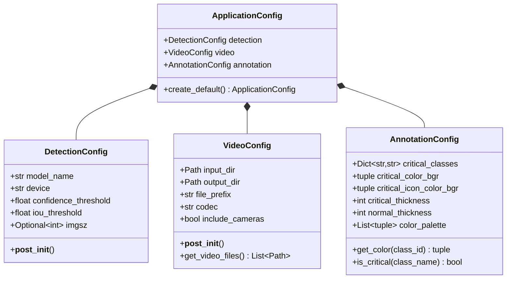

# Configuration Guide

## Overview

The yolodetector pipeline uses dataclass-based configuration defined in `yolodetector/config.py`. Configuration is structured hierarchically:

- **ApplicationConfig** — Top-level container
  - **DetectionConfig** — YOLO model and inference parameters
  - **VideoConfig** — Input/output paths and video settings
  - **AnnotationConfig** — Visual styling and critical class definitions

---

## Configuration Hierarchy



---

## DetectionConfig

Controls YOLO model selection and inference behavior.

### Fields

| Field | Type | Default | Description |
|-------|------|---------|-------------|
| `model_name` | `str` | `"yolo26x.pt"` | YOLO model file (e.g., `yolov8n.pt`, `yolov8x.pt`) |
| `device` | `str` | `"mps"` | Device for inference: `cpu`, `cuda`, `mps` |
| `confidence_threshold` | `float` | `0.25` | Confidence threshold (0.0-1.0). Objects with confidence below this are discarded |
| `iou_threshold` | `float` | `0.45` | IoU threshold for Non-Maximum Suppression (0.0-1.0) |
| `imgsz` | `Optional[int]` | `None` | Inference image size (e.g., 640, 1280). If `None`, uses model default |

### Validation

- `confidence_threshold` must be in range [0.0, 1.0]
- `iou_threshold` must be in range [0.0, 1.0]

### Example

```python
from yolodetector.config import DetectionConfig

config = DetectionConfig(
    model_name="yolov8x.pt",
    device="cuda",
    confidence_threshold=0.30,
    iou_threshold=0.50,
    imgsz=640
)
```

---

## VideoConfig

Controls video input/output paths and file discovery.

### Fields

| Field | Type | Default | Description |
|-------|------|---------|-------------|
| `input_dir` | `Path` | `"."` | Directory containing input video files |
| `output_dir` | `Path` | `<input_dir>/output` | Directory for output annotated videos (auto-created) |
| `file_prefix` | `str` | `"dummy"` | File prefix to search for (e.g., `"2026-02-04 10-17-17"`) |
| `codec` | `str` | `"mp4v"` | Video codec for output files |
| `include_cameras` | `bool` | `False` | Include `_FACE` and `_TOP` camera angles |

### Behavior

- `__post_init__()` converts string paths to `Path` objects
- `output_dir` is created if it doesn't exist
- `get_video_files()` discovers input files based on `file_prefix` and `include_cameras`

### File Discovery Logic

```python
# include_cameras=False → searches for:
#   <input_dir>/<file_prefix>.mp4

# include_cameras=True → searches for:
#   <input_dir>/<file_prefix>.mp4
#   <input_dir>/<file_prefix>_FACE.mp4
#   <input_dir>/<file_prefix>_TOP.mp4
```

If the main file (`<file_prefix>.mp4`) is missing, raises `FileNotFoundError`. Camera angle files are optional.

### Example

```python
from pathlib import Path
from yolodetector.config import VideoConfig

config = VideoConfig(
    input_dir=Path("/Volumes/Video/2026-02-04"),
    output_dir=Path("/Users/analyst/results"),
    file_prefix="2026-02-04 10-17-17",
    include_cameras=True
)

# Discover video files
files = config.get_video_files()
# files = [
#   Path("/Volumes/Video/2026-02-04/2026-02-04 10-17-17.mp4"),
#   Path("/Volumes/Video/2026-02-04/2026-02-04 10-17-17_FACE.mp4"),
#   Path("/Volumes/Video/2026-02-04/2026-02-04 10-17-17_TOP.mp4"),
# ]
```

---

## AnnotationConfig

Controls annotation rendering, colors, and critical object definitions.

### Fields

| Field | Type | Default | Description |
|-------|------|---------|-------------|
| `critical_classes` | `Dict[str, str]` | `{"cell phone": "PHONE"}` | Maps class names to display labels for critical objects |
| `critical_color_bgr` | `tuple` | `(0, 0, 255)` | BGR color for critical object boxes (red) |
| `critical_icon_color_bgr` | `tuple` | `(0, 255, 255)` | BGR color for warning triangle icon (yellow) |
| `critical_thickness` | `int` | `4` | Bounding box line thickness for critical objects |
| `normal_thickness` | `int` | `2` | Bounding box line thickness for normal objects |
| `color_palette` | `List[tuple]` | 20-color palette | BGR colors for normal object bounding boxes |

### Methods

- `get_color(class_id: int) -> tuple` — Returns a consistent color for a class ID (cycles through palette)
- `is_critical(class_name: str) -> bool` — Checks if a class name is marked as critical

### Adding Critical Classes

Modify `critical_classes` to mark additional object types as critical:

```python
from dataclasses import field
from yolodetector.config import AnnotationConfig

config = AnnotationConfig(
    critical_classes={
        "cell phone": "PHONE",
        "laptop": "COMPUTER",
        "handbag": "BAG",
    }
)
```

Or edit the default in `yolodetector/config.py`:

```python
@dataclass
class AnnotationConfig:
    critical_classes: Dict[str, str] = field(default_factory=lambda: {
        "cell phone": "PHONE",
        "laptop": "COMPUTER",  # Add new critical class here
    })
```

### Color Palette

The default palette has 20 colors. For class ID `n`, the color is `color_palette[n % 20]`.

**BGR format** (OpenCV convention):
- `(0, 0, 255)` → Red
- `(0, 255, 0)` → Green
- `(255, 0, 0)` → Blue
- `(0, 255, 255)` → Yellow

---

## ApplicationConfig

Top-level configuration container. Composes `DetectionConfig`, `VideoConfig`, and `AnnotationConfig`.

### Fields

| Field | Type | Description |
|-------|------|-------------|
| `detection` | `DetectionConfig` | YOLO model and inference settings |
| `video` | `VideoConfig` | Video input/output settings |
| `annotation` | `AnnotationConfig` | Annotation styling and critical classes |

### Factory Method

```python
@classmethod
def create_default(cls,
                  input_dir: str = ".",
                  file_prefix: str = "dummy",
                  model_name: str = "yolo26x.pt") -> "ApplicationConfig"
```

Creates an `ApplicationConfig` with default values. Useful for CLI defaults.

### Example

```python
from yolodetector.config import ApplicationConfig, DetectionConfig, VideoConfig, AnnotationConfig

app_config = ApplicationConfig(
    detection=DetectionConfig(model_name="yolov8x.pt", device="cuda"),
    video=VideoConfig(input_dir=".", output_dir="./output", file_prefix="video"),
    annotation=AnnotationConfig()
)
```

Or use the factory:

```python
app_config = ApplicationConfig.create_default(
    input_dir="/path/to/videos",
    file_prefix="2026-02-04 10-17-17",
    model_name="yolov8x.pt"
)
```

---

## CLI Override

CLI flags in `main.py` override config defaults:

| CLI Flag | Config Path |
|----------|-------------|
| `--model` | `detection.model_name` |
| `--device` | `detection.device` |
| `--conf` | `detection.confidence_threshold` |
| `--iou` | `detection.iou_threshold` |
| `--imgsz` | `detection.imgsz` |
| `--input-dir` | `video.input_dir` |
| `--output-dir` | `video.output_dir` |
| `--prefix` | `video.file_prefix` |
| `--all`, `--include-cameras` | `video.include_cameras` |

---

## Programmatic Usage

```python
from pathlib import Path
from yolodetector.config import ApplicationConfig, DetectionConfig, VideoConfig, AnnotationConfig

# Build configuration programmatically
detection = DetectionConfig(
    model_name="yolov8x.pt",
    device="mps",
    confidence_threshold=0.30,
    iou_threshold=0.50,
    imgsz=640
)

video = VideoConfig(
    input_dir=Path("/Videos"),
    output_dir=Path("/Results"),
    file_prefix="2026-02-04 10-17-17",
    include_cameras=True
)

annotation = AnnotationConfig(
    critical_classes={
        "cell phone": "PHONE",
        "laptop": "COMPUTER",
    }
)

app_config = ApplicationConfig(
    detection=detection,
    video=video,
    annotation=annotation
)

# Use with pipeline
from yolodetector.models import YoloDetector
from yolodetector.annotation import FrameAnnotator
from yolodetector.video import VideoIO
from yolodetector.reporting import ReportAggregator

detector = YoloDetector(app_config.detection.model_name)
annotator = FrameAnnotator(app_config.annotation)
video_io = VideoIO()
reporter = ReportAggregator(app_config.annotation.critical_classes)
```

---

## Best Practices

1. **Use CLI flags for one-off runs** — Quick testing, different input directories
2. **Modify `config.py` defaults for persistent changes** — Team-wide standards, deployment defaults
3. **Use factory methods for programmatic usage** — Scripting, automation, testing
4. **Validate configuration early** — `DetectionConfig.__post_init__()` validates thresholds at construction time
5. **Keep critical_classes in sync with model capabilities** — Standard COCO models don't include "glasses"; requires YOLO-World or custom training

---

## Related Documentation

- [Architecture](architecture.md) — System design and data flow
- [CLI Reference](cli-reference.md) — Command-line flags and usage examples
- [Development Guide](development.md) — Setup and contribution workflow
