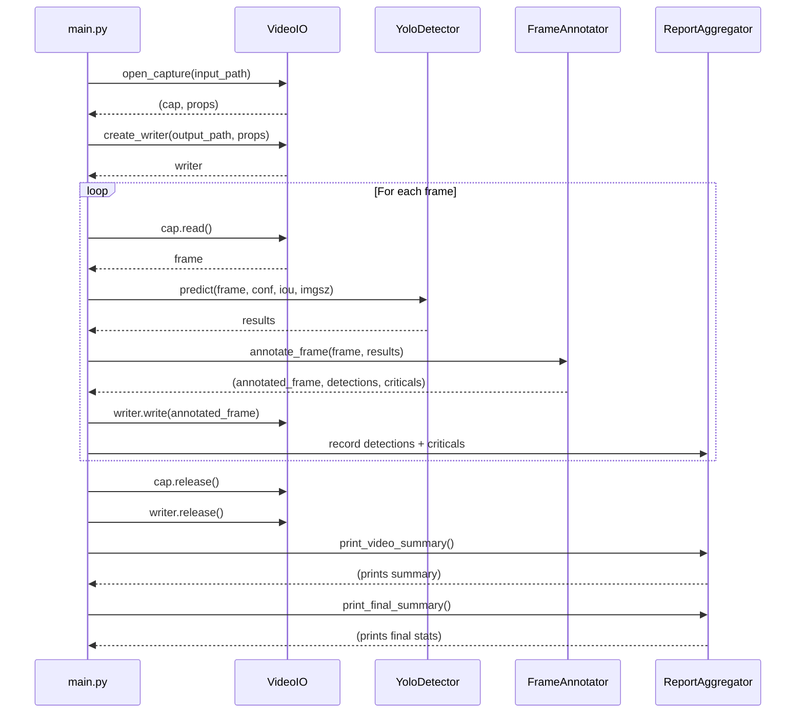

# Development Guide

## Prerequisites

- **Python 3.10+** (tested with 3.11)
- **Conda** or **virtualenv** (recommended)
- **Git** (for version control)
- **CUDA toolkit** (optional, for NVIDIA GPU acceleration)
- **Apple Silicon** (optional, for MPS acceleration)

---

## Setup

### 1. Clone Repository

```bash
git clone <repository-url>
cd yolodetector
```

### 2. Create Virtual Environment

**Using Conda:**
```bash
conda create -n yolodetector python=3.11
conda activate yolodetector
```

**Using venv:**
```bash
python -m venv venv
source venv/bin/activate  # macOS/Linux
# or
venv\Scripts\activate  # Windows
```

### 3. Install Dependencies

```bash
pip install -r requirements.txt
```

**Dependencies:**
- `ultralytics>=8.0.0` — YOLO model library
- `opencv-python>=4.8.0` — Video I/O and rendering
- `numpy>=1.24.0` — Array operations
- `tqdm>=4.65.0` — Progress bar

### 4. Verify Installation

```bash
python -c "from yolodetector.models import YoloDetector; print('OK')"
```

Expected output: `OK`

*(Note: YOLO model download will occur on first inference run, not during import.)*

---

## Project Structure

```
.
├── main.py                         # CLI entry point and orchestration
├── requirements.txt                # Python dependencies
├── CLAUDE.md                       # Project guidance
├── AGENTS.md                       # Agent roles and skills
├── README_DETECTION.md             # Usage guide
├── yolodetector/
│   ├── __init__.py
│   ├── config.py                   # Configuration dataclasses
│   ├── models/
│   │   ├── __init__.py
│   │   └── detector.py             # YOLO model wrapper
│   ├── annotation/
│   │   ├── __init__.py
│   │   └── renderer.py             # Frame annotation
│   ├── video/
│   │   ├── __init__.py
│   │   └── io.py                   # Video I/O
│   └── reporting/
│       ├── __init__.py
│       └── summary.py              # Statistics aggregation
├── tests/
│   ├── conftest.py                  # Shared test fixtures
│   ├── test_config.py               # Config tests
│   ├── test_detector.py             # Detector tests
│   ├── test_renderer.py             # Renderer tests
│   ├── test_video_io.py             # Video I/O tests
│   ├── test_reporter.py             # Reporter tests
│   └── test_integration.py          # Integration tests
└── docs/
    ├── architecture.md              # System design
    ├── cli-reference.md             # CLI usage
    ├── configuration.md             # Config reference
    ├── SETUP.md                     # Platform setup
    ├── TROUBLESHOOTING.md           # Common issues
    ├── USAGE.md                     # Usage examples
    └── development.md               # This file
```

---

## Development Workflow

### Running the Pipeline

```bash
# Basic usage
python main.py

# With custom parameters
python main.py --all --conf 0.20 --model yolov8x.pt

# Debug mode (verbose logging)
python main.py --conf 0.15 --imgsz 640 --device cpu
```

### Code Style

- Follow **PEP 8**
- Use **type hints** for all function signatures
- Prefer **dataclasses** over plain dictionaries for structured data
- Keep functions **small and single-purpose** (SRP)

### Linting and Formatting

```bash
# Install dev tools
pip install black flake8 mypy

# Format code
black main.py yolodetector/

# Lint
flake8 main.py yolodetector/

# Type check
mypy main.py yolodetector/
```

---

## Adding a New Critical Class

### 1. Identify the Class Name

Check if the class is available in the YOLO model:

```python
from yolodetector.models import YoloDetector

detector = YoloDetector("yolov8x.pt")
print(detector.names)
```

Output (COCO classes):
```python
{0: 'person', 1: 'bicycle', ..., 67: 'cell phone', ...}
```

### 2. Update `AnnotationConfig`

Edit `yolodetector/config.py`:

```python
@dataclass
class AnnotationConfig:
    critical_classes: Dict[str, str] = field(default_factory=lambda: {
        "cell phone": "PHONE",
        "laptop": "COMPUTER",  # New critical class
    })
```

### 3. Test

```bash
python main.py --conf 0.25 --model yolov8x.pt
```

Check console output for `[CRITICAL]` marker next to the new class.

---

## Adding a New Pipeline Stage

### Policy

**From `AGENTS.md` and `CLAUDE.md`:**
> When adding new pipeline stages or responsibilities, update AGENTS.md first, then update the yolodetector package and main.py.

### Steps

#### 1. Update `AGENTS.md`

Add new agent definition:

```markdown
## Agents
...
5. FilterAgent
   - Applies post-processing filters (blur, denoising).
   - Owns filter selection and parameter tuning.
   - Implemented in yolodetector/filters/processor.py.
```

#### 2. Create New Module

Create `yolodetector/filters/processor.py`:

```python
"""Frame filtering and post-processing."""

class FrameFilter:
    def apply(self, frame):
        # Filter logic here
        return filtered_frame
```

Create `yolodetector/filters/__init__.py`:

```python
"""Frame filtering utilities."""

from yolodetector.filters.processor import FrameFilter

__all__ = ["FrameFilter"]
```

#### 3. Update `main.py`

Inject new stage into pipeline:

```python
from yolodetector.filters import FrameFilter

def main():
    # ...
    filter_agent = FrameFilter()

    for input_path in input_files:
        # ...
        for frame in frames:
            results = detector.predict(frame, ...)
            annotated_frame = annotator.annotate_frame(frame, results)
            filtered_frame = filter_agent.apply(annotated_frame)  # New stage
            writer.write(filtered_frame)
```

#### 4. Update `CLAUDE.md`

Add to "Files of Interest":

```markdown
## Files of Interest
...
- yolodetector/filters/processor.py: frame filtering and post-processing.
```

---

## Detection Processing Sequence



**Sequence:**

1. `main.py` opens video capture via `VideoIO.open_capture()`
2. `main.py` creates video writer via `VideoIO.create_writer()`
3. **Frame Loop:**
   - Read frame from capture
   - Run inference via `YoloDetector.predict()`
   - Annotate frame via `FrameAnnotator.annotate_frame()`
   - Write annotated frame to output
   - Record detections and critical objects
4. Release resources (capture, writer)
5. Print per-video summary via `ReportAggregator.print_video_summary()`
6. Print final summary via `ReportAggregator.print_final_summary()`

---

## Testing

### Unit Testing

The project includes a comprehensive test suite with 47 unit and integration tests covering all library modules.

**Install test dependencies:**
```bash
make install-dev
# OR
pip install pytest pytest-cov pytest-benchmark black isort pylint mypy bandit safety
```

**Run all tests:**
```bash
make test
# OR
pytest tests/ -v
```

**Run specific test modules:**
```bash
make test-config      # Config validation tests
make test-detector    # Model loading and inference tests
make test-annotator   # Frame annotation tests
make test-video       # Video I/O tests
make test-reporter    # Reporting and JSON export tests

# OR directly with pytest
pytest tests/test_config.py -v
```

**Run with coverage:**
```bash
make test-coverage
# OR
pytest tests/ --cov=yolodetector --cov-report=html --cov-report=term
```

**Test structure:**
```
tests/
├── conftest.py          # Shared fixtures (mock frames, YOLO results)
├── test_config.py       # DetectionConfig, VideoConfig, AnnotationConfig
├── test_detector.py     # Model path resolution, inference kwargs
├── test_renderer.py     # Frame annotation, critical detection
├── test_video_io.py     # Video capture, writer, property handling
├── test_reporter.py     # Summary printing, JSON export
└── test_integration.py  # Cross-module integration tests
```

### Manual Testing

```bash
# Test main video only
python main.py --prefix "test-video" --input-dir ./test_data

# Test all cameras
python main.py --all --prefix "test-video" --input-dir ./test_data

# Test with debug logging
python main.py --log-level DEBUG --prefix "test-video" --input-dir ./test_data

# Test JSON report export
python main.py --prefix "test-video" --input-dir ./test_data --report-json report.json
```

### Validation Checklist

- [ ] All unit tests pass (`make test`)
- [ ] Video files are processed without errors
- [ ] Output files are created in `output/` directory
- [ ] Bounding boxes are visible on output video
- [ ] Critical objects have red boxes + yellow warning triangle
- [ ] Console summary shows detection counts
- [ ] Critical objects are listed with frame numbers
- [ ] JSON report (if enabled) contains valid structure

### Performance Testing

```bash
time python main.py --all --model yolo26x
```

Expected FPS (M3 Max, MPS):
- `yolov8n.pt`: ~60 FPS
- `yolo26x.pt`: ~30 FPS
- `yolov8x.pt`: ~25 FPS

---

## Debugging

### Enable Verbose Logging

Use the `--log-level` CLI flag for operational visibility:

```bash
# DEBUG: Detailed logs (model resolution, file operations, frame stats)
python main.py --log-level DEBUG

# INFO: Key operations (model loaded, video opened, summaries)
python main.py --log-level INFO

# WARNING: Only warnings and errors (default)
python main.py --log-level WARNING
```

**Log output example (DEBUG level):**
```
12:34:56 [yolodetector.models.detector] DEBUG: Resolving model path for: yolo26x (normalized: yolo26x.pt)
12:34:56 [yolodetector.models.detector] INFO: Using local model file: yolo26x.pt
12:34:57 [yolodetector.models.detector] INFO: Model loaded: yolo26x (80 classes)
12:34:57 [yolodetector.video.io] INFO: Opening video: /path/to/video.mp4
12:34:57 [yolodetector.video.io] DEBUG: Video properties: 1920x1080 @ 30.0 FPS, 900 frames
```

### Inspect Detection Results

Add debugging in `main.py` after inference:

```python
results = detector.predict(frame, ...)

# Debugging
for result in results:
    print(f"Boxes: {result.boxes}")
    print(f"Classes: {result.boxes.cls}")
    print(f"Confidences: {result.boxes.conf}")
```

### Check Frame Properties

```python
cap, props = video_io.open_capture(input_path)
print(f"Width: {props.width}, Height: {props.height}")
print(f"FPS: {props.fps}, Total frames: {props.total_frames}")
```

---

## Common Issues

### "Model download failed"

**Cause:** Network issue or missing internet connection.

**Solution:**
- Ensure internet connectivity
- Manually download model from Ultralytics and place in `~/.cache/ultralytics/`

### "Could not open video file"

**Cause:** File path incorrect or file missing.

**Solution:**
- Verify input file exists: `ls -la <input-dir>/<prefix>.mp4`
- Check file permissions
- Ensure video is in a supported format (MP4, AVI)

### "MPS backend warnings"

**Cause:** Some operations fall back to CPU on Apple Silicon.

**Solution:**
- Normal behavior on M1/M2/M3 Macs
- Does not affect correctness, only slight performance impact
- Ignore warnings or use `--device cpu` to avoid MPS entirely

### Low FPS / Slow Processing

**Solutions:**
- Use smaller model: `--model yolov8n.pt`
- Reduce inference size: `--imgsz 640`
- Lower confidence threshold: `--conf 0.30`
- Use GPU: `--device cuda` (NVIDIA) or `--device mps` (Apple)

---

## Contributing

1. **Create a feature branch:**
   ```bash
   git checkout -b feature/new-critical-class
   ```

2. **Make changes following design principles:**
   - SRP, DI, config-driven
   - Update AGENTS.md first for new responsibilities
   - Update CLAUDE.md "Files of Interest" for new modules

3. **Test locally:**
   ```bash
   python main.py --all --input-dir ./test_data
   ```

4. **Commit and push:**
   ```bash
   git add .
   git commit -m "Add laptop as critical class"
   git push origin feature/new-critical-class
   ```

5. **Open pull request**

---

## Design Principles Recap

- **Single Responsibility Principle (SRP):** Each module owns one concern
- **Dependency Injection:** `main.py` constructs and injects dependencies
- **Configuration-Driven:** All parameters in dataclasses, overridable via CLI
- **Stable Interface:** Preserve existing CLI flags for backwards compatibility

See [Architecture](architecture.md) for detailed design documentation.

---

## Related Documentation

- [Architecture](architecture.md) — System design and data flow
- [CLI Reference](cli-reference.md) — Command-line flags and usage examples
- [Configuration Guide](configuration.md) — Config dataclass reference
